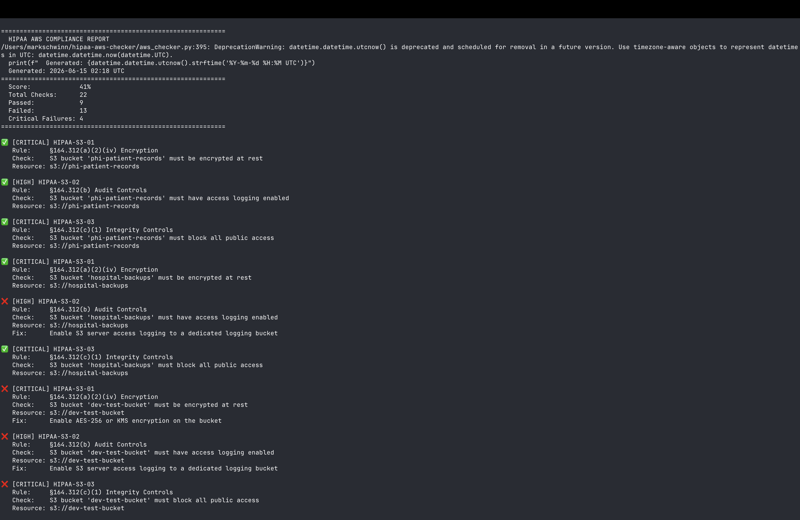

# 🏥 HIPAA AWS Security Compliance Checker

A Python-based CLI tool that audits AWS configurations against **HIPAA Security Rule** requirements helping healthcare organizations identify misconfigurations that could expose Protected Health Information (PHI).

Supports both **live AWS mode** (via boto3) and **demo mode** (simulated data, no credentials needed).

Built by an IAM engineer working in a live HIPAA-regulated clinical environment. Every check maps to a real compliance requirement enforced in production healthcare systems.

---

## 🔍 What It Checks

| Category | Controls | HIPAA Citation |
|---|---|---|
| **S3 Buckets** | Encryption at rest, public access blocking, access logging | §164.312(a)(2)(iv), §164.312(b) |
| **IAM** | Root MFA, user MFA enforcement, password policy strength | §164.312(d), §164.308(a)(5) |
| **CloudTrail** | Multi-region logging, log file validation | §164.312(b), §164.312(c)(1) |
| **RDS Databases** | Encryption at rest, backup retention >= 7 days | §164.312(a)(2)(iv), §164.308(a)(7) |
| **VPC / Network** | Flow logs enabled, default security group lockdown | §164.312(e)(1), §164.312(a)(1) |
| **Monitoring** | GuardDuty threat detection, AWS Config change tracking | §164.308(a)(1)(ii)(D) |

---

## 🚀 Quick Start

```bash
# Clone the repo
git clone https://github.com/markthedev12/hipaa-aws-checker.git
cd hipaa-aws-checker

# Install dependencies
pip install -r requirements.txt

# Run in demo mode (no AWS credentials needed)
python aws_checker.py --demo

# Run against a real AWS account (requires configured credentials)
python aws_checker.py
```

---

## 🔐 AWS Credentials Setup (Live Mode)

This tool uses **read-only AWS permissions only**. Never run security audits with root credentials.

**Step 1 — Create a read-only IAM policy:**

Attach the following AWS managed policies to your audit user or role:
- `SecurityAudit` (AWS managed)
- `ReadOnlyAccess` (AWS managed)

**Step 2 — Configure the AWS CLI:**

```bash
pip install awscli
aws configure
# Enter your Access Key ID, Secret Access Key, and region
```

**Step 3 — Run the checker:**

```bash
python aws_checker.py
```

---

## 📋 Sample Output

```
============================================================
  HIPAA AWS COMPLIANCE REPORT
  Generated: 2026-06-15 02:18 UTC
============================================================
  Score:             41%
  Total Checks:      22
  Passed:            9
  Failed:            13
  Critical Failures: 4
============================================================

❌ [CRITICAL] HIPAA-S3-01
   Rule:     §164.312(a)(2)(iv) Encryption
   Check:    S3 bucket 'dev-test-bucket' must be encrypted at rest
   Fix:      Enable AES-256 or KMS encryption on the bucket

✅ [HIGH] HIPAA-IAM-02
   Rule:     §164.312(d) Authentication
   Check:    All IAM users must have MFA enabled
   Resource: iam::users
```

A full `hipaa_report.json` is saved after every run.

---

## 📸 Demo Screenshots

### Compliance Summary


### Detailed Check Results


---

## 📁 Project Structure

```
hipaa-aws-checker/
├── aws_checker.py      # Main compliance checker (demo + live boto3 mode)
├── hipaa_report.json   # Auto-generated report (after run)
├── requirements.txt    # Python dependencies
└── README.md
```

---

## 🔧 Security Design

This tool was designed with security-first principles:

- **Read-only by design** — only AWS read permissions are required; the tool never modifies resources
- **No credentials in code** — relies on AWS CLI profile or IAM role, never hardcoded keys
- **Least privilege** — the minimum IAM permissions needed are `SecurityAudit` and `ReadOnlyAccess`
- **Local output only** — reports are saved locally as JSON; no data is transmitted externally

---

## 🗺️ Roadmap

- [x] Demo mode with simulated AWS config
- [x] Live boto3 AWS integration
- [ ] HTML report export
- [ ] Email alerting for critical failures
- [ ] Scheduled Lambda deployment
- [ ] CIS AWS Foundations Benchmark mapping
- [ ] Azure / SC-200 version

---

## 📚 HIPAA Security Rule References

- [HHS HIPAA Security Rule Summary](https://www.hhs.gov/hipaa/for-professionals/security/index.html)
- [AWS HIPAA Compliance Guide](https://aws.amazon.com/compliance/hipaa-compliance/)
- [NIST 800-66 HIPAA Implementation Guide](https://csrc.nist.gov/publications/detail/sp/800-66/rev-2/final)

---

## 👨‍💻 Author

**Mark Schwinn** — IAM & Microsoft Security Engineer | Healthcare IT | AWS | CompTIA Security+

[](https://linkedin.com/in/mark-schwinn-994625362)
[](https://github.com/markthedev12)
[](https://markschwinn.com)
