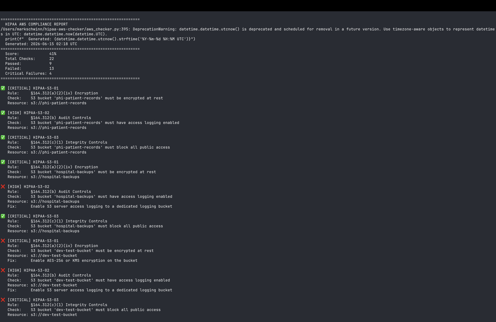

# HIPAA AWS Security Checker

Python CLI that audits an AWS account for security misconfigurations and maps every finding to the HIPAA Security Rule requirement it relates to.

Runs in **demo mode** with simulated data (no AWS account needed) or **live mode** against a real account through boto3.

> Personal lab project. It helps find misconfigurations, and passing every check does not make an environment HIPAA compliant.

## What it checks

| Category | Controls | HIPAA citation |
| --- | --- | --- |
| S3 | Encryption at rest, public access blocking, access logging | 164.312(a)(2)(iv), 164.312(b) |
| IAM | Root MFA, user MFA enforcement, password policy strength | 164.312(d), 164.308(a)(5) |
| CloudTrail | Multi region logging, log file validation | 164.312(b), 164.312(c)(1) |
| RDS | Encryption at rest, backup retention of 7 days or more | 164.312(a)(2)(iv), 164.308(a)(7) |
| VPC | Flow logs enabled, default security group locked down | 164.312(e)(1), 164.312(a)(1) |
| Monitoring | GuardDuty threat detection, AWS Config change tracking | 164.308(a)(1)(ii)(D) |

## What you get

* A pass or fail result for every check, with a severity rating
* The HIPAA citation each check relates to
* A suggested fix for every failing check
* An overall compliance score with pass, fail and critical failure counts
* A `hipaa_report.json` file written after every run

## Quick start

```bash
git clone https://github.com/markthedev12/hipaa-aws-checker.git
cd hipaa-aws-checker
pip install -r requirements.txt

# Demo mode, no credentials needed
python aws_checker.py --demo
```

## Live mode

Use a dedicated read only role or an SSO profile. Never run audits with root credentials, and never put access keys in code. The tool uses the standard AWS credential chain, so setting the `AWS_PROFILE` environment variable selects the profile.

```bash
aws configure sso --profile audit-readonly
AWS_PROFILE=audit-readonly python aws_checker.py
```

## Sample output

```
============================================================
  HIPAA AWS COMPLIANCE REPORT
============================================================
  Score:             41%
  Total Checks:      22
  Passed:            9
  Failed:            13
  Critical Failures: 4
============================================================

[FAIL] [CRITICAL] HIPAA-S3-01
   Rule:     164.312(a)(2)(iv) Encryption
   Check:    S3 bucket dev-test-bucket must be encrypted at rest
   Fix:      Enable AES-256 or KMS encryption on the bucket

[PASS] [HIGH] HIPAA-IAM-02
   Rule:     164.312(d) Authentication
   Check:    All IAM users must have MFA enabled
```

Sample from demo mode with simulated data.

## Screenshots




## Design decisions

* **Read only.** The tool never modifies AWS resources.
* **No credentials in code.** It relies on an AWS profile, SSO or an IAM role.
* **Local output only.** Reports stay on your machine and nothing is sent externally.

## Limitations

* Point in time snapshot of the account, not continuous monitoring.
* Covers only the services listed above.
* The HIPAA mapping is my interpretation of how each setting relates to the rule. It is not legal or compliance advice.

## Roadmap

- [x] Demo mode with simulated AWS data
- [x] Live AWS mode with boto3
- [ ] Automated tests and GitHub Actions CI
- [ ] HTML report export
- [ ] CIS AWS Foundations Benchmark mapping
- [ ] Custom least privilege IAM policy for the tool
- [ ] Scheduled runs with Lambda

## References

* [HHS HIPAA Security Rule summary](https://www.hhs.gov/hipaa/for-professionals/security/index.html)
* [AWS HIPAA compliance guide](https://aws.amazon.com/compliance/hipaa-compliance/)
* [NIST SP 800-66 HIPAA implementation guide](https://csrc.nist.gov/publications/detail/sp/800-66/rev-2/final)

## Author

Mark Schwinn · [Website](https://markschwinn.com) · [LinkedIn](https://www.linkedin.com/in/mark-schwinn-994625362/)
